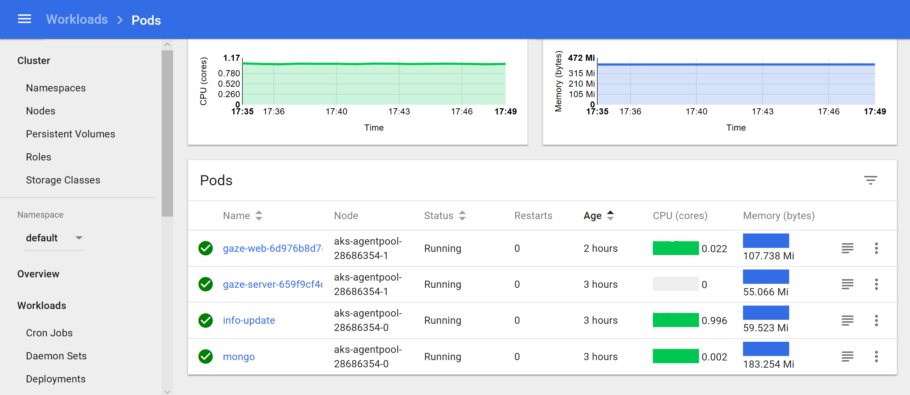
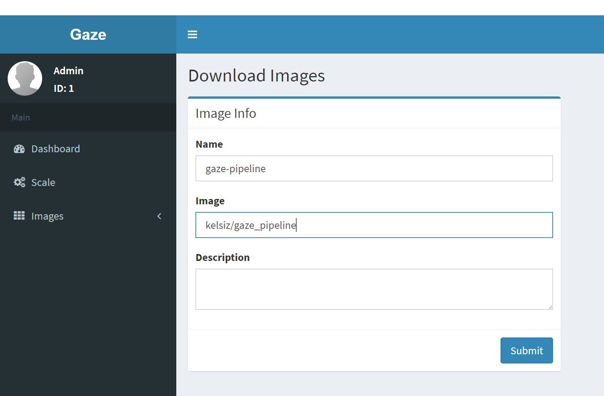
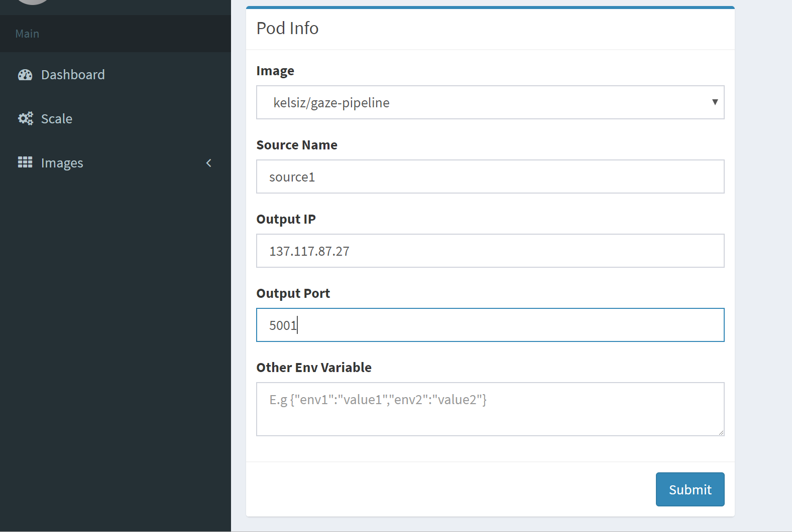
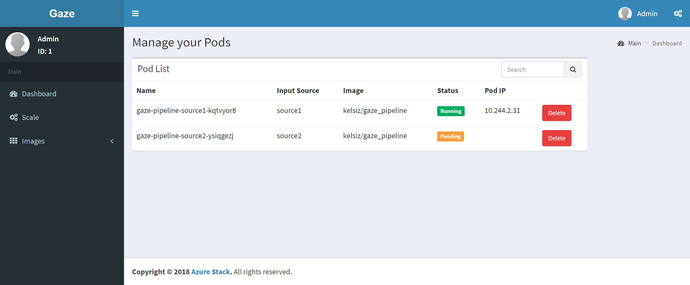

# Gaze intelligent video cloud service
The Gaze Real-Time Video Analytics Service Platform integrates the computing power of private clouds with data from IoT devices such as cameras, providing scalable, scalable video analytics on the Edge.

# Overview
Today's society is full of cameras. According to statistics, 85% of the data on the Internet is video data, and it is still growing rapidly. When people talk about big data and IoT devices, big data mainly refers to video data, and IoT devices mainly refer to cameras. But has massive data been fully exploited and utilized? The answer is limited by video analysis capabilities, which are like dark matter and far from being used effectively.

According to a low-definition camera, the amount of video accumulated per day is 1.5G, and in HD, it is 15G. If a mall has a hundred cameras installed, the amount of data is T-level. If you pass this data to the public cloud, it is an attack, not a use. Therefore, video analysis on the public cloud will not be worth the candle, but it is a perfect combination with the private cloud.

With this in mind, we propose Gaze to integrate the computing power of private clouds with data from IoT devices such as cameras. Provides scalable, scalable video analysis capabilities at the Edge. For developers, if there is a need for video analysis, we can convert some video streams into event streams based on our pre-built "building blocks" by simple statements, and pass them through event hub and Kafka. Downstream.

# Architecture


# Quick start
Use the yaml file in the source code:
```bash
$ kubectl apply -f gaze.yaml
```
It will deploy several services and pods in kubernetes cluster:


* gaze-web : Visit its external endpoint, then you can easily manage the images and pods to process the input video streams.
* mongo : A mongoDB is deployed in k8s, which is used to record all necessary information of images, pods, envs, etc.
* [gaze-server](./pod_proxy.py) : Send your video stream to this external endpoint. It will identify the source of the stream and send it to the pod configured to process the stream.
* [info-update](./pod_update.py) : This service will continuously monitor the status of the pods in the cluster and update the information in mongoDB.


## Dev environment
For developers, you can easily use the nodes provided in [gaze framework](https://github.com/Kelsiii/Gaze/tree/master/gaze) to create a pipeline to deal with the video streams. Also, you can use this framework to develop your own nodes and combine them into a pipeline. See the example [here](./core_pipeline.py). 

## Portal 
### Upload your image
1. After finish the core code, build it as a docker image and push it to a registry (whether Docker Hub or Azure Container Registry).
2. Visit portal > Images > Add Image
3. Input the name of your image and submit.


### Manage the scale
1. When you have a new video input source, visit portal > Scale
2. Choose which image you want to use to process the video stream.
3. Input the source name, output IP and port, and other environmental variables you need to use in the container.

And you can check the pod status in portal > Dashboard


### Input video stream and see the output
The [webcam.py](./example/webcam.py) and [output.py](./example/output.py) show you how to send the video stream to the service and see the output. 
#### Dependency
* [OpenCV-Python with GStreamer](https://docs.opencv.org/trunk/d2/de6/tutorial_py_setup_in_ubuntu.html)
* [pyzmq](https://learning-0mq-with-pyzmq.readthedocs.io/en/latest/pyzmq/basics.html#installation)  
